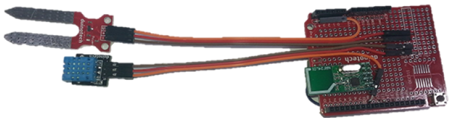

# Wireless Garden Monitor
_Project 00002_

## Bill of Materials

| Qty | Code | Description |
| --- | --- | ---|
|2 | [XC4410](http://jaycar.com.au/p/XC4410) | Uno Board
|2 | [XC4482](http://jaycar.com.au/p/XC4482) | Prototyping shield
|1 | [XC4520](http://jaycar.com.au/p/XC4520) | temperature sensor
|2 | [XC4508](http://jaycar.com.au/p/XC4508) | 2.4Ghz wireless transceiver
|1 | [XC4604](http://jaycar.com.au/p/XC4604) | soil moisture sensor
|1 | [WC6028](http://jaycar.com.au/p/WC6028) | plug-socket jumper leads
|1 | [XC4630](http://jaycar.com.au/p/XC4630) | LCD touch screen

## Connection Table
### Similar to both transmitter and receiver
|Prototyping shield| wireless transceiver |
|---| --- |
|3.3|VCC and CE|
|GND|GND |
|D10| CSN
|D11 | MO
|D12 | MI
|D13 | SCK

### transceiver
|Prototyping shield | Soil sensor | Temp sensor |
| --- | ---  |  --- |
|5V | + | + |
|GND | - | - |
|A5 |S | |
|D8 | | S|

_Receiver just uses the LCD shield and so no further connections required_

## Downloads
* [Source code](http://github.com/duinotech/Wireless-Garden-Monitor/archive/master.zip)

## Software Libraries
_Currently we have libraries on our website that have been modified to work with
our modules, if you experience issues, look on the product pages for an alternative
library to use_

|Library | Author
| --- |--- |
|Adafruit GFX | Adafruit|
|TFTLCD | Adafruit|
|RF24 | tmrh20|
|TouchScreen | Adafruit |

## Assembly
### Radio on protoshield
This is similar for both units so is a good place to start. get two radios and
two shields, and solder them similar to the following pictures:

The radio hangs over the bottom of the shield to allow for better radio reception.

### Test radio connections
Mount the shield on both of the UNOs and mount the LCD on one as the receiver.
The transmitter has not been connected to any sensors yet but that is ok as we're
just testing the radio link.

Download the sketches that go along with this project and upload onto each UNO.
you should be able to check that the LCD screen initialises and displays something
like the following

If the radios are both working correctly, you'll see a green 'R' flash in the top right corner of the display about every five seconds, and after a few minutes, numbers and graph lines will appear.
If the radios are not working, check the wiring for both prototyping shields.

### Sensors on transmitter

The receiver unit is complete, but the transmitter (the one without the screen)
should be powered down so we can add the sensor modules. We've used two groups
of red, brown and orange wires from the WC6028, and wired the reds to the +5V
bus and the browns to the GND bus at the end of the Prototype Shield.

See how the pin ends are staggered to keep the cables flat. The orange for the Soil
Sensor goes to A5, and the orange for the Temperature and Humidity Sensor goes
to D8. The modules can then be plugged in at the other end.

The transmitter unit
can now be powered up again, and after a minute, we should see valid data
appearing on the display.

### Install
The final step will be to install the units where they can be used. You might need to fit a rainproof container if the transmitter is to be set up outside, and also extend the Soil Sensor wires.

## Programming
Download the source code and extract into a new folder, open the .ino file in the Arduino IDE and press upload.

## Use
There is not much to operating the transmitter, as it automatically transmits about once every five seconds. The code for the transmitter simply initialises everything, reads the sensors, then transmits the data along with a checksum code and waits five seconds till the next transmission is needed.

The receiver is a bit more complicated, and most of the code is to do with drawing and updating the screen. During the setup() function, the screen and radio module are initialised, and some of the unchanging parts of the screen are drawn (title, y-axis and text at the bottom of the screen).During the loop() function, the Uno mostly waits for radio data, then every minute (this can be changed by the SAMPLET value), the most recent data is saved to an array. If it's a multiple of 15 minutes, this is also saved to another part of the array, and similarly if it's a multiple of two hours. This gives us samples that cover either an hour, a day or a week. After a sample is saved, the rest of the screen is redrawn- the graphs, x-axis and large numbers at the bottom of the screen.

In loop(), the sketch also checks the touch panel, and if a touch is detected at the bottom of the screen, the xaxis is changed, and the screen is redrawn with the appropriate data for an hour, day or week display. If the graph area of the screen is touched, the cursor is moved to highlight a different part of the graph. Note that the large numbers at the bottom of the screen correspond to the value under the cursor and not the current values.

## Future Improvements
